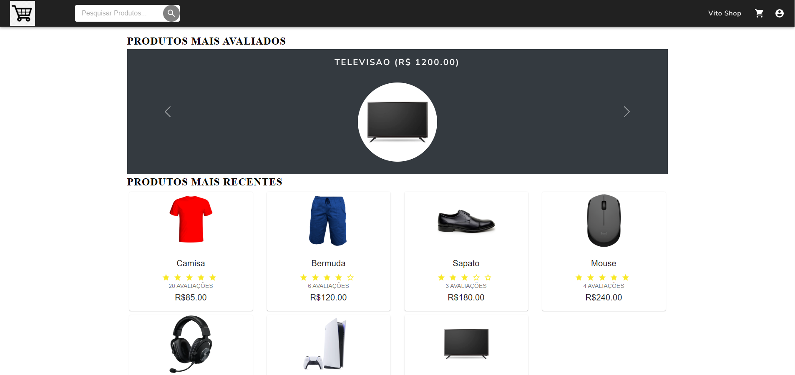
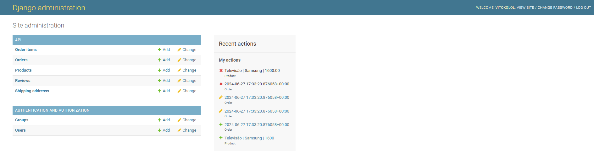

# Projeto E-commerce

### Introdução
#### Projeto demonstrativo para criação de um site e-commerce de produtos variados, gerenciado pelo administrador, com integração de pagamentos via PayPal e cartão de crédito. A aplicação foi desenvolvida utilizando Django, React, Kubernetes e Docker.


<p align="center">
  
</p>


<p align="center">
  
</p>

---

### Como utilizar o projeto

Após realizar o clone do repositório, basta criar a pasta de ambiente env dentro da pasta do projeto e então instalar as dependências necessárias no terminal:
```
python -m venv env
pip install -r requirements.txt
```
Obs: o arquivo requirements.txt estará dentro da pasta backend, portanto tenha certeza de estar dentro da pasta correta para a instalação.

Pressione F1 e selecione (no VSCode):
- Python: Select Interpreter
- Selecione o Python da pasta env

Ou em algum outro compilador de sua escolha.

Após a instalação dos requirements, ative os scripts da env no terminal:
```
.\env\Scripts\Activate.ps1
```

Agora só falta acionar a api do django:
```
python manage.py makemigrations
python manage.py migrate
```

Prossiga para o diretório backend e então utilize o seguinte comando:
```
python manage.py runserver
```

Com a página do django, é possível criar e personalizar as ordens, criar os produtos e gerenciar toda a infraestrutura do site em si.

Para visualizar a página do react, basta entrar no diretório do frontend com um novo terminal e utilizar o seguinte comando:
```
npm install
npm start
```

Pronto, agora você pode visualizar o site disponível para os clientes.
